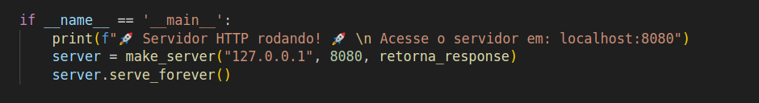
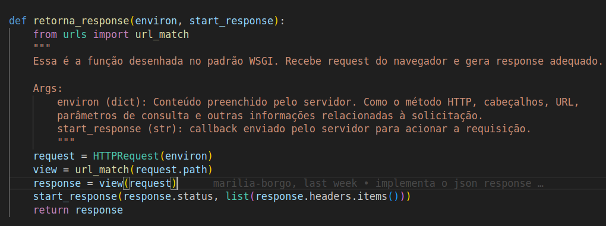

## Backend

### WGSI 

O que significa o WGSI? Significa We're Gonna Solve It!
Esse será o nome do nosso protocolinho para comunicação com servidor!

Na verdade, o nome do arquivo deveria ser WSGI, um padrão (protocolo) de interface de comunicação da aplicação python e o servidor web proposto pela [PEP 333](https://peps.python.org/pep-0333/).

Só que na hora do sono, acabamos digitando WGSI, ao invés de WSGI, e bem, Apesar do Vamos resolver isso! Nós não vamos resolver isso.

Oficialmente, nosso protocolinho de comunicação com servidor será conhecido como "WGSI", que, é claro, ainda significa "We're Gonna Solve It!" (Vamos Resolver Isso!). Contudo, vamos apenas deixar assim, está bem? Mas procurem por WSGI!

O PEP 333 diz que como tudo começa! Tudo precisa começar com uma função (um chamável) que recebe um dicionário com variáveis de ambiente e uma outra função. Ela será responsável pela primeira comunicação com a web.

A nossa função recebe o nome de  "retorna_response(environ, start_response)".

Ao executar o comando 'python3 wgsi.py', server deixa disponível na porta 8080 o acesso para nosso backend. Quando alguém acessar essa porta, então será executado o **retorna_response**, terceiro parâmetro da função make_server(). 

A função **retorna_response()** é a função principal de um servidor WSGI. Ela recebe uma solicitação do navegador (através do parâmetro environ) e retorna uma resposta (através do parâmetro start_response).

O primeiro passo da função é criar uma instância de HTTPRequest a partir do dicionário environ. O objeto HTTPRequest representa a solicitação do navegador. Ele contém informações como o método HTTP, os cabeçalhos, a URL, os parâmetros de consulta e outras informações relacionadas à solicitação.

Em seguida, a função chama a função url_match() para encontrar qual view (função que recebe um request e responde um response) deve ser executada para atender à solicitação. A função url_match() recebe a URL da solicitação como parâmetro (request.path).

Se a função url_match() retornar uma função view, a função retorna_response() chama a função view com o objeto HTTPRequest como parâmetro. A função view é responsável por gerar a resposta para a solicitação.

Finalmente, a função retorna_response() chama a função start_response() para informar ao servidor que a solicitação foi processada. A função start_response() recebe o código de status da resposta e uma lista de cabeçalhos como parâmetros.

O código de status da resposta indica o resultado da solicitação. Por exemplo, o código de status 200 OK indica que a solicitação foi bem-sucedida.

Os cabeçalhos da resposta fornecem informações adicionais sobre a resposta. Por exemplo, o cabeçalho Content-Type indica o tipo de conteúdo da resposta.

É importante entender o que são as classes HTTPRequest, JesonResponse e HttpResponse. Pois elas serão usadas nas nossas funcoes_request_response.