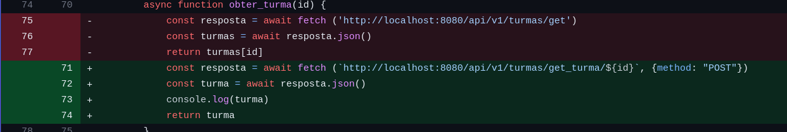

## Como fazer o pull request no local correto.

Devido a orientação do professor, não vamos poder commitar na MAIN. 
Dessa forma, vamos fazer uma branch por sprint.
Nossa primeira sprint vai ter a branch.

```

S-01/main-primeira-sprint

```

### Como se fosse a primeira vez: configurando upstream

a) Conectando o repositório original na upstream

É preciso entender que seu código habitará, em pelo menos, três arquivos. 
- Na sua máquina, chamada de local.
- No seu repositório remoto. Seu fork.
- No repositório original, upstream

Para que todos tenham as modificações de todos, o caminho para puxar atualizações sempre será upstream > fork > repositório local.

Avô -> pai -> filho. 

Não é uma boa ideia puxar modificações de avô direto para filho, tá!

No seu repositório local, será necessário indicar quem será a upstream, ou seja, a upstream é a ligação direta com projeto original.

```
git remote add upstream https://github.com/ClaraSantosmf/FATEC-API-1-SEMESTRE
```

Agora seu repositório está dessa forma. 



git push e git pull enviarão as modificações para seu fork. 
git pull upstream vai trazer as informações do repositório original.

Mas por que não posso fazer git push upstream? Porque upstream não autoriza pull de repositório original. 

Agora, com o comando para listar os nomes das branchs da upstream.

```
git ls-remote 
```

Deve haver um retorno desse estilo


A partir disso, vamos criar uma branch que será sincronizada direta com a upstream. 


Como você já sabe, nossa primeira sprint será a partir da S-01/main-primeira-sprint


 b) criando sua branch para copiar a upstream. 

Você não deve fazer alterações direto na upstream, então vamos copia-la!


```
git switch -c S-01/main-primeira-sprint
```

O que isso faz? Cria uma nova branch local chamada S-01/main-primeira-sprint. Faz o checkout daquela branch. Faz o pull das alterações de origin/S-01/main-primeira-sprint para aquela branch

c) Puxando alterações da upstream. 

Agora você deve puxar as atualizações da upstream. 

```
git pull upstream S-01/main-primeira-sprint

```

Agora sua branch trará todas as atualização dessa branch da upstream. É a partir dessa branch atualizada, que você deve criar suas branchs!


### Depois de ter branch s-01 criada!
Primeira opção para sincronizar seu projeto - syncfork

Entrou para trabalhar e precisa puxar atualizações dos colegas? Simples. 

Abra seu repositório no GitHub

No seu Repositório mude para a branch : S-02/main-segunda-sprint

Sincronize seu Fork:


Abra seu projeto na máquina

No terminal, mude para branch S-02/main-segunda-sprint

```
Rode o comando git pull
```

Agora mude para a branch que esta trabalhando na sua máquina

```
Use o comando git merge S-02/main-segunda-sprint
```

Agora a branch que esta trabalhando na sua maquina esta sincronizada com as branch S-02/main-segunda-sprint

Commite

### Outra opção de sincronização: upstream - sem precisar sincronizar o fork

No seu projeto, com comandos apenas do terminal, comece indo para a branch principal da sprint. Nesse exemplo, a S-02!

```
git switch S-02/main-primeira-sprint
```

Rode o comando para trazer as atualizações.

```
git pull upstream S-01/main-primeira-sprint

```

Agora mude para sua branch de trabalho. Vou usar a minha como exemplo que é a branch "Santos/implementando-WSGI"

```
git switch Santos/implementandoW-WSGI
```

E agora o comando de mergear (misturar atualizações com seu código)

```
git merge S-01/main-primeira-sprint
```

Tudo certo e nada errado! Você tem uma branch na sua última versão. 


## Pull Request e Code Review. Como fazer boas constribuições?

Passos para contribuir:

    while projeto == inacabado:
        1- Atualize a main
        2- Crie sua branch
        3- Realize commites atômicos
        4- Realize um push para criar um PR
        5- Peça codeReview
        6- Faça os reparos necessários no CodeReview
        7- Seja aprovado e mergeado

### O que é pull request?

**Pull Request** é a nossa forma de contribuição o projeto. Sugerimos a leitura dessa [documentação](https://www.digitalocean.com/community/tutorials/como-criar-um-pull-request-no-github-pt) especifica sobre como contribuir em um projeto GitHub.

Para algo de consulta rápida e explicações breve para o dia a dia, deixo esse [Medium](https://medium.com/@clarasantosmf/subindo-altera%C3%A7%C3%B5es-para-github-68a0b28f14d).

### O que é code review?
O **Code Review**  é um processo no fluxo de desenvolvimento de software. Alguém propõe alterações ou criação no código por meio de um *pull request* (PR) e é analisado por outras pessoas.
Isso ajuda identificar bugs e melhora a qualidade das implementações e compartilhar conhecimento.

A responsabilidade de manter o CR em dia é de todos. Todos podem fazer e opinar.

### Boas práticas

<aside>
💡 Antes de revisar o código, tenha como premissa que o autor do **PR** fez o seu melhor em prol de solucionar o problema.

</aside>

### **Revisor**

Leia a descrição do PR, deve estar descrito o problema que a implementação se propõe resolver. Não encontrou na descrição do PR? Peça para que o autor ajuste isso e dedique um tempo para entender o contexto e as motivações das mudanças.

Faça comentários através de observações, impactos, requisições e perguntas. Exemplos:

|  | ❌ ☹️ | ✅ 😀 | Por quê? |
| --- | --- | --- | --- |
| Observação | Você está fazendo uma implementação errada. | Essa implementação está repetida em outro contexto e poderia ser reutilizada. $LINK | A revisão é sobre o código, nunca sobre o autor. Fornecer links, quando possível, de certa forma é uma gentileza e ajuda o autor a entender seu ponto de vista. Sugerir rápidas edições pode ajudar também. |
| Impacto | Essa implementação não está clara. | Essa implementação não deixa claro o objetivo do método por X motivo. | Explicar o impacto permite que o autor entenda a motivação da sua observação e não desvaloriza o trabalho que já foi feito. |
| Requisição | - Use o padrão X. Faça Y. | Para esse cenário eu sugiro fazer/usar X, por N motivos | Um ponto de vista mais pessoal se aproxima da forma com que conversamos no dia a dia, afirmações no imperativo podem soar rudes. Explicar o motivo da requisição encoraja a colaboração. |
| Pergunta | Por que você não faz X? | O que você acha de fazer X? Pode ajudar em Y. | Por meio das respostas, podemos entender melhor a decisão para certo ponto do código. |


- Entenda que existem diferentes soluções para o mesmo problema:
    - Nem sempre a melhor solução é a que você esta propondo;
    - Com o time, chegue na melhor solução para o problema com o atual conhecimento deles;
- Tenha claro a distinção entre **boas práticas** e **gosto pessoal**;
- Deixe claro quais comentários são “bloqueantes” (não vai subir sem que aquilo seja ajustado) e você espera que haja uma alteração significativa.
- Se sua revisão possui apenas pequenos apontamentos que podem ser facilmente resolvidos, considere aprovar a solicitação e orientar o autor sobre isso nos comentários, de modo que ele não precise aguardar novamente.
- Se você acredita que PR está muito grande, explique o motivo e incentive o autor a dividi-lo em menores partes.
- Não foque em deixar o PR excelente (A+), mas em melhorá-lo a ponto de ficar MVP e planeje evoluções futuras.
- Antes de enviar o comentário de CR se pergunte:
    - A afirmação é verdadeira?
    - O comentário está agregando valor para o PR (principalmente se estamos contribuindo com o conhecimento do time e pessoa que abriu PR)?
    - Estou sendo gentil?

### **Autor**

Assuma como premissa que o revisor está querendo contribuir e tenha humildade para ouvir sobre o seu trabalho. **Você e o revisor são do mesmo time**.

### Você deve ✅

- Dar o máximo de contexto ao abrir um PR, lembre-se que o revisor não tem tanto contexto quanto você. Escreva uma boa descrição ou deixe um link nela.
- Encarar a revisão como aprendizado.
- Entender que somos sempre enviesados pelo nosso próprio código.
- Estar aberto a opiniões externas: seu código não é seu "bichinho de estimação".
- Entender que é normal ter bugs, implementações melhores ou esquecer de algum detalhe.

### Não deve ❌

- Encarar comentários como crítica pessoal;
- Levar críticas para o lado pessoal, **você não é o seu código**;


### **Código**

- Simples é melhor do que complexo: cuidado com **over-engineering** *(implemente o que você realmente precisa, não tente adivinhar o que você vai precisar no futuro);*
- Antes de aplicar um **design pattern**, tenha claro qual problema ele resolve e qual ele não resolve, para não cair em *~~anti-pattern~~* sem saber *([📖 livro](https://pragprog.com/titles/mnee2/release-it-second-edition/))*;

### Checklist

Ao revisar um código, é bom (para o autor e para o revisor) ter um checklist do que precisa ser avaliado. Conferir todos os aspectos do código de uma vez pode ser exaustivo e propenso a falhas, portanto é bom atentar-se a um tópico e validar todo conteúdo sob aquela ótica.

- [ ]  Entendi o problema?
- [ ]  Entendi o que o código está fazendo?
- [ ]  O código atende todos os requisitos de implementação?
- [ ]  A implementação resolve o problema apresentado ou está claro como mediremos isso?
- [ ]  A descrição da PR/commit está conforme a implementação feita?
- [ ]  Atenção a sintaxe, não tem nenhum *code smells/*indícios de um problema mais profundo?
- [ ]  As exceções necessárias foram tratadas?
- [ ]  Alguma documentação adicional precisa ser feita?

### **Referências**

- [Code Review Guidelines for Humans](https://phauer.com/2018/code-review-guidelines/)
- [How to Make Good Code Reviews Better - Stack Overflow Blog](https://stackoverflow.blog/2019/09/30/how-to-make-good-code-reviews-better/)
- [Boas práticas de reviews](https://google.github.io/eng-practices/review/)


## Como configurar o projeto?

Precisamos rodar nosso projeto na nossa máquina! Nisso, vamos configura-la de forma a conseguir exercutar o PBLTeX!

### Virtualenvs
A maneira mais fácil de todos terem as mesmas configurações do projeto na máquina é por meio de uma virtualenv. 

> Aplicações em Python normalmente usam pacotes e módulos que não vêm como parte da instalação padrão. Aplicações às vezes necessitam uma versão específica de uma biblioteca, porque ela requer que algum problema em particular tenha sido consertado ou foi escrita utilizando-se de uma versão obsoleta da interface da biblioteca. A solução para este problema é criar um ambiente virtual, uma árvore de diretórios que contém uma instalação Python para uma versão particular do Python, além de uma série de pacotes adicionais. [Virtualenvs - docs](https://docs.python.org/pt-br/3/tutorial/venv.html)


#### Instale o pyenv

 Use o pyenv para gerenciar as versões de Python e seus virtualenvs. Para instalar ele, use o [pyenv-installer](https://github.com/pyenv/pyenv-installer). No repositório tem as instruções detalhadas, mas talvez seja só isso aqui:

```shell
curl https://pyenv.run | bash
```

Reinicie o terminal e você já deve conseguir usar o pyenv.

```
# Instale uma versão do 3.11.x.
pyenv install 3.11.0
# Crie um virtualenv buser com a versão que você acabou de instalar.
pyenv virtualenv 3.11.0 PBLTeX
```

O arquivo `.python-version` já diz para o `pyenv` usar o env `PBLTeX` quando estiver na pasta do projeto.
Ou seja, nosso ambiente vai ser sempre ativado automaticamente. Mas caso precise ativa-lo, sempre que quiser, pode fazer:


```
pyenv activate PBLTeX
```

Instale as dependências com os seguintes comandos:

```shell
pip install -r requirements.txt
```

Rode o projeto com:

```
python3 wgsi.py

```
Nesse momento, nosso servidor está fornecendo informações na porta :8080

Porém, nosso frontend estará na porta:5500
Então, para olhar o backend : http://127.0.0.1:8080/
Para olhar para o frontend http://127.0.0.1:5500/


## Diferença entre JSON e CSV

[JSON (JavaScript Object Notation):](https://www.json.org/json-en.html) O JSON é um formato de dados que é comumente usado para trocar informações estruturadas entre sistemas. Ele é fácil de ler e escrever tanto para humanos quanto para máquinas. Um arquivo JSON possui as seguintes características:

- **Sintaxe**:
    
	 - O JSON é baseado em pares de chave-valor. Os dados são armazenados em um formato semelhante a um dicionário em Python ou um objeto em JavaScript.
	- A chave é sempre uma string, seguida por dois pontos (`:`), e o valor pode ser de qualquer tipo de dado suportado pelo JSON (string, número, booleano, array, objeto, null).

````json
{ 
	"nome": "João",
	"idade": 30, 
	"casado": true, 
	"interesses": ["música", "viagem", "esportes"], 
	"endereço": { 
		"rua": "123 Main Street", 
		"cidade": "São Paulo", 
		"estado": "SP" 
	}
}
````

- Uso:
	- O JSON é frequentemente usado para configurar aplicativos, transmitir dados pela web e armazenar informações estruturadas em arquivos.

- **Vantagens**:
	- Suporta dados aninhados e estruturas complexas.
	- Pode representar diferentes tipos de dados, como strings, números, listas, objetos, etc.
	- É fácil de entender e ler.
	- É usado para configurações de aplicativos e troca de dados entre sistemas.
- **Desvantagens**:
	- Pode ser menos eficiente em termos de espaço quando comparado ao CSV para grandes conjuntos de dados tabulares simples.


[CSV (Comma-Separated Values):](https://docs.python.org/3/library/csv.html) O CSV é um formato simples para armazenar dados em formato tabular, onde as colunas são separadas por vírgulas e as linhas são separadas por quebras de linha. Cada linha representa um registro e cada campo (valor) é separado por uma vírgula.

- **Sintaxe**:
    
	- Os valores são separados por vírgulas (daí o nome "Comma-Separated Values").
	- Pode haver uma linha de cabeçalho que define os nomes das colunas.

````plaintext
Nome,Idade,Email
Sara,30,saranahra@hotmail.com 
Caio,33,caiopalma@gmail.com
````

- Uso:
	- O CSV é comumente utilizado para armazenar e compartilhar dados tabulares, como planilhas ou conjuntos de dados estruturados. Ele é amplamente suportado por planilhas e aplicativos de banco de dados.

- **Vantagens**:
	- É eficiente para grandes conjuntos de dados tabulares simples.
	- É fácil de ser lido e editado em qualquer editor de texto.
	- Amplamente suportado por planilhas e bancos de dados.
- **Desvantagens**:
	- Não suporta estruturas de dados complexas diretamente (como objetos aninhados).

**Resumo:**  A escolha entre JSON e CSV dependerá do tipo de dados que você está manipulando e das necessidades específicas do seu aplicativo ou uso. JSON é mais adequado para dados complexos e aninhados, enquanto CSV é excelente para dados tabulares simples e eficiência de armazenamento.

https://docs.python.org/3/library/csv.html

https://www.json.org/json-en.html

## Comandos para executar o clone no git

### Passo 1: pegando o link do repositório 
Ir no repositório do GitHub e clicar em "code", depois https e copiar o link.

### Passo 2: criando uma pasta para o repositório
Ir no terminar (Windows Power Shell) e criar uma pasta:

````shell
mkdir Pasta
cd Pasta
```` 

### Passo 3: clonando o repositório e abrindo no VSCode

````shell
git clone copiar-o-link-obtido-do-github
cd nome-do-projeto
git fetch origin
git checkout -b nome-do-projeto origin/nome-do-projeto
git branch -a
git pull
code .
````

### Passo 4: comitando no repositório após as alterações
Após fazer as alterações no código seguir os proximos passos para comitar:

````shell
git add . 
commit -m adicionar-novo-arquivo
git push
````
