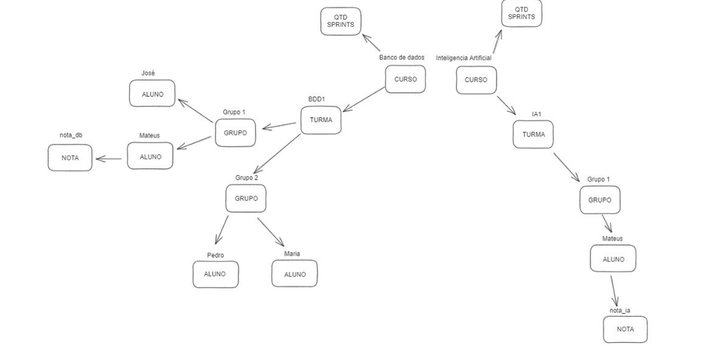

<h1> Resumo das Retros </h1>

## Retro - 25 de setembro de 2023
### Problemas que tiveram:

* **Comunicação**:
**Caio**: Whatsapp fica ruim os debates complexos.
**Marília**: Precisamos tornar as coisas mais assíncronas.
**Clara**: Ausência de alguns integrantes. Demora para pedir ajuda.

* **Conhecimento técnico**:
**Sara**: Onde vai mexer na documentação. E o que as coisas serve com projeto principal. E onde enfiar
as coisas. Definir tarefas.
**Mateus**: Como fazer isso? As instruções iniciais.
**William**: Ficou perdido.
**Ruth**: Como fazer isso? As instruções iniciais.
**Dani**: Precisa de previsão do que precisa ser feito. Como fazer isso? As instruções iniciais.

### Coisas boas:
**Dani**: Documento de apoio para instrução.
**Ruth**: Documentação.
**Caio**: Organização e democracia.
**Clara**: Todo mundo quer aprender.
**William**: Forçou a estudar coisas novas.
**Marília**: Existe a proatividade em perguntar.

### Ações para remediar:

- Clara vai descrever como ocorrer o processo de recuperação de dados por meio da API via documentação.
- Marília vai produzir um roadmap de estudos para apoio.
- Discussões complexas devem ir para o teams.
- Ruth vai dar um help para galera que quer entender mais de como fazer deploy na documentação.
- Com backlog, vamos ter mais orientação.

## Retro - 17 de outubro de 2023

**Problemas**

**Caio**: Melhorar estratégia para ter menos conflito ao final.
**Mateus**: Sentimos falta do William.
**Marília**: Não resolveram os conflitos, teve muito CR de uma vez, saimos muito do escopo do card.
**Eruano**: Ritmo diferente, precisa de espaço para desenvolver a task.
**Danielle**: Ritmo diferente, precisa de espaço para desenvolver a task.
**Ruth**: Faltou mais descrição no INDEX
**Sara**: Nenhuma.

**Coisas Boas**

**Caio**: Foi mais fluído
**Mateus**: Foi mais fluído
**Marília**: Todo mundo aprendeu bastante!
**Eruano**: Equipe está bem integrada
**Danielle**: Tudo fluiu melhor e pareceu mais claro as tasks.
**Ruth**: Faltou mais descrição no INDEX
**Sara**: Nenhum. 

### Manias que não podemos mais ter! 
Cheia de manias, toda dengosaaaaaa, menina linda, sabe que não pode gerar débito técnico

#### Resolva seu conflito. 

É de responsabilidade do dono da branch deixa-la sempre atualizada e sem conflitos. Isso evita retrabalho nos CRs a serem feitos.

#### Teste sua funcionalidade com a branch atualizada. 

Após resolver conflitos e determinar que sua branch está atualizada, é de responsabilidade dos donos da branch testar suas features para entrega-las funcionando. Porque pode ser que os novos commites precisem que adequação com seu código.  

#### Compreenda os limites do seu CARD. 

Os cards já foram excessivamente descritos e eles precisam ter os limites da task respeitados. Ou haverá retrabalho e conflitos. 
Houve diversas ultrapassagem dos limites da task, como por exemplo, para editar, foi criado as funções de criar. 
Nesse caso vamos adotar as mocks!

#### Mock
1. Crie o nome da função e sua assinatura que precisa
2. Mock o retorno -> Faça retornar uma informação necessária para sua função funcionar. 
3. Desenvolva sua função

Por exemplo, esse buscar grupo era para ser um MOCK. 

#### Retire a mock quando desenvolver a função

Caso alguém tenha feito um mock de uma função que você vai desenvolver, agora você tem o DEVER de retirar aquela mock e desenvolver a lógica. 
Ou seja, a primeira pessoa fez a MOCK, e a segunda, que era para desenvolver a função, acabou não retirando a mock e sobrou duas funções com mesmo nome. 
AI MEU PARCEIRO, AI COMPLICA!!

#### Nomes melhores e que fazem sentido.

* API V1 no nome da função não é adequado, isso fica indicado já na URL. Então def api_v1_turmas_excluir() ta feio. Então a URL deve ser URL("/api/v1/turmas/excluir/:id"), mas a função deve ser tão somente excluir_turma. 

* Padrão vai ser em portugues. 

* Quando se trata de uma variável, classe ou atributo, é uma boa ideia pensar em substantivos e adjetivos. Por quê? Bem, esses caras geralmente apontam para algo ou alguém, o que facilita bastante a compreensão do seu código.
Exemplo: turma no retorno de uma função que te volta uma turma!

Por o nome de "variável" ou só "resposta", pode causar muita dificuldade na interpretação do código depois. 

Agora, quando se trata de métodos, usem verbos. Eles denotam ações dos objetos, o que ele faz!

Claro, nós sabemos que às vezes as coisas podem ficar um pouco confusas. Alguns de nós pensam que devem usar o infinitivo o tempo todo. Você sabe, algo como "criar_turma()" para uma função. Mas vamos dar um passo para trás e manter as coisas simples. Vamos verbo conjugado no presente? criando_turma(). Tudo bem? 

#### Dar nome as API ou URLs segundo o padrão proposto.

Existiram muitas propostas de nome para API, mas agora definimos uma forma melhor de configurar um nome! Por favor, [sigamos](backend.md#urls)

#### Colocar as funções no lugar correto

Se a função altera ou cria grupo, ela precisa estar no módulo correto de grupo! Vai usar a função que altera ou cria grupo? Importa a função. MESMO que mockada. 
Exemplo: essa função que salva grupo ta no lugar errado

#### Processamento de dados é no backend

O Frontend renderiza do lado do usuário, então processar dados no Frontend é uma má prática e deve ser uma excessão:
* Processar dados no Frontend expõe os informações desnecessárias do nosso backend, afetando a segurança.
* Dependendo do dispositivo, é impossível carregar o frontend (imagina um celular fuleira tentando renderizar seu for grandão)
* O backend é capaz de lidar com muito mais requisição e escalar maior processamento.

Portanto, melhor que seja feito um endpoint novo que retorna os dados específicos, do que usar um endpoint geral que retorna diversas informações que não são necessárias. No caso a seguir, temos um get pegando todas as turmas, para no frontend, seja escolhido qual é a turma que será alterada. 
A melhor estratégia foi criar novo endpoint que deixa o processo de achar a turma certa para o backend.

