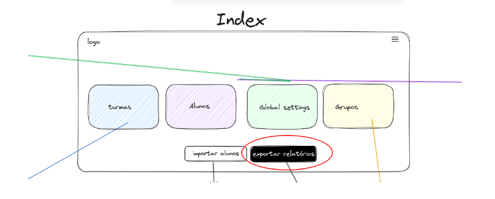
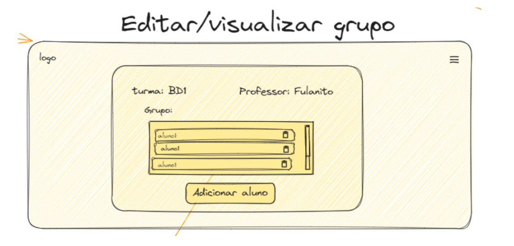
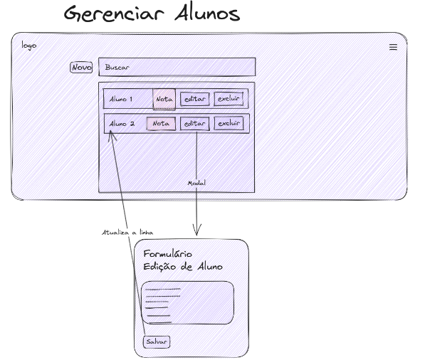
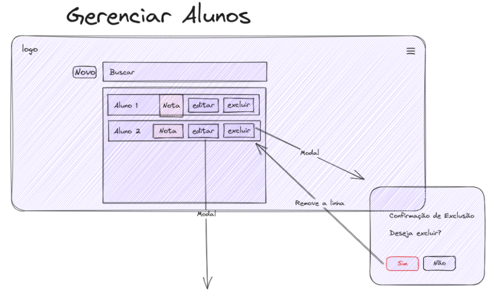
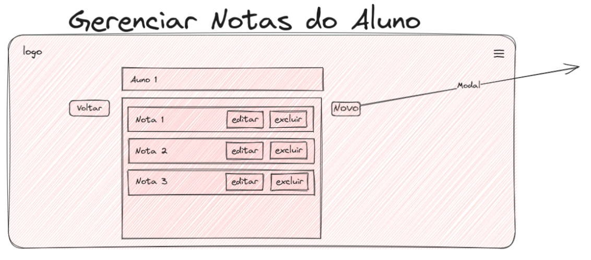
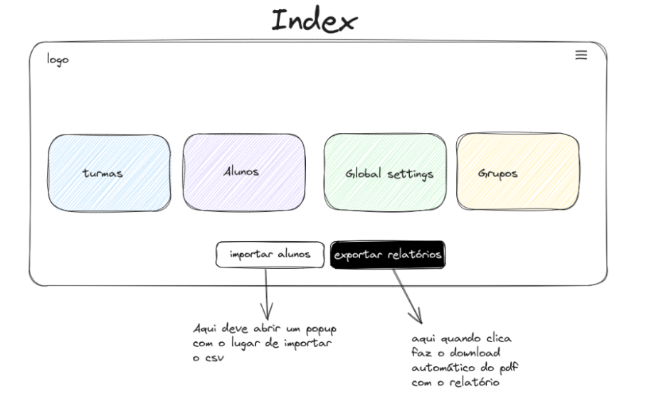

<h1> BACKLOG API 1 SEMESTRE </h1>

## Épicos

- **Exportação de Dados (Back-end)**: A consolidação e exportação de dados costumam ser tarefas realizadas no back-end, pois envolvem o processamento e a preparação de dados para exportação.
- **Gerenciamento de Turmas (curso)** : Esse épico está relacionado à criação, atualização e visualização de turmas, que envolvem a interface do usuário para realizar essas operações.
- **Gerenciamento de grupo** : Esse épico está relacionado à criação, atualização e visualização de grupos, que envolvem a interface do usuário para realizar essas operações.
- **Gerenciamento de Alunos** : Esse épico lida com a adição, atualização e visualização de informações de alunos, bem como a adição de notas parciais, todos os quais são interações do usuário com a interface.
- **Gerenciamento de Ciclos de Entrega e Scores:** Este épico envolve a criação, atualização e visualização de ciclos de entrega e scores parciais, que são aspectos visíveis para o usuário.
- **Visibilidade e Acompanhamento:** Esse épico visa fornecer informações objetivas sobre turmas, grupos de alunos, etc. A apresentação dessas informações é uma preocupação do front-end.
- **Configurações Globais (Back-end):** Este épico envolve a definição de parâmetros globais e o afeta o funcionamento do sistema. Essa configuração geralmente é tratada no back-end.
- **Importação de Dados massivo (Back-end):** A tarefa de carregar informações de alunos e scores a partir de arquivos é uma operação que envolve o back-end, pois requer manipulação de dados.

## Detalhamento dos Épicos

## **Épico 1: Exportação de Dados**

#### **História de Usuário 1: Como um administrador, eu quero selecionar as opções de gerenciamento e relatórios. Isso envolve a exportação de dados.**

**Frontend:**

- Botão no Index.html que gere relatórios vindo dos: gerenciamento_turmas.html, gerenciamento_alunos.html, gerenciamento_ciclos.html, gerenciamento_global.html.



**Backend:**

- Rota da API

  - /api/relatorio/criar: Consolida os dados e exporta em formato PDF.
  - Consolida os dados e os exporta em formato PDF.

## **Épico 2: Gerenciamento de Turmas**

#### **História de Usuário 1: Como um administrador, eu quero visualizar a lista de turmas disponíveis, seus respectivos grupos com os alunos e alunos.**

**Frontend:**

- Gerenciamento_turmas.html que conterá todas as turmas já criadas com ícone de edição e de exclusão em cada um deles.
- Deverá ser criado um campo onde serão inseridas as turmas de forma dinâmica.
- Botão para criar uma nova turma.


**Backend**

- Módulo gerenciador_turmas.py com funções para listar turmas.
- Rotas de API:
  - /api/turmas/get: Retorna a lista de turmas disponíveis.
  - /api/turmas/delete: Deletar uma turma.

#### **História de Usuário 2: Como um administrador, eu quero criar uma nova turma com nome da turma, o professor e a associação de grupos pré-existentes ou nenhum grupo. A turma não precisa ser criada com grupo de alunos, mas precisa poder recebê-los. A turma só será ativa com grupo de alunos vinculados.**

**Frontend:**

- Template HTML para Gerenciamento de Turmas:

  - criar_turma.html que conterá os formulários para criar uma nova turma.
  - A inclusão de grupos de alunos não precisa ser obrigatória.
  - Nome da turma e professor são obrigatórios.
  - Campo para procurar por um grupo pré-existente
  - Campo para listar grupos


**Backend:**

- Módulo gerenciador_turmas.py com funções para criar uma turma com/sem novo grupo de alunos.
- Rotas de API:

  - /api/turmas/criar: Manipula a criação de uma nova turma.
  - /api/grupos /listar: Manipula a lista de grupos preexistente

#### **História de Usuário 3: Como um administrador, eu quero editar as informações de uma turma e adicionar mais grupos.**

- Template HTML para Gerenciamento de Turmas:
  - editar_turmas.html que conterá os formulários de edição de uma nova turma, com possibilidade de ser levada a edição de grupo e de criar novo grupo.


- Módulo gerenciador_turmas.py com funções para atualizar informações de turma e editar grupo de alunos.
- Rotas de API:

  - /api/turmas/atualizar/{id}: Manipula a atualização das informações de uma turma específica.
  - /api/grupos/atualizar/{id}: Manipula a atualização das informações de um grupo de alunos específico.

#### **História de Usuário 4: Como um administrador, eu quero excluir uma turma e um grupo de alunos.**

**Frontend:**

    	Ícone de exclusão do grupo


- Módulo gerenciador_turmas.py com funções para excluir turmas.
- Rotas de API:
  - /api/turmas/excluir/{id}: Manipula a exclusão de uma turma específica.
  - /api/grupos/excluir/{id}: Manipula a exclusão de um grupo específico. (Vamos excluir o grupo?)

### Épico 3: Gerenciamento de grupos

#### **História de Usuário 1: Como administrador, quero ver todos os grupos formados e associados às turmas.**

**Frontend:**

- Template HTML para visualização de grupos:
  - gerenciamento_grupos.html que conterá todos os grupos já criados com ícone de edição e de exclusão em cada um deles.
  - Cada grupo deve apresentar seu nome e respectiva turma.


**Backend:**

- Módulo gerenciador_grupos.py com funções para listar os grupos associados às turmas.
- Rotas de API:
  - /api/grupos/listar: Manipula a listagem de grupos.

#### **História do usuário 2: Como um administrador, eu quero criar grupos de alunos associado a uma turma.**


**Frontend**

- Template HTML para criar um grupo:
  - criar_grupo.html que conterá os formulários de criação de um novo grupo
  - Selecionar a qual turma ele pertencerá.
  - Para adicionar um grupo é necessário inserir o nome do grupo e a turma.

**Backend**

- Módulo gerenciador_grupo.py com funções para adicionar pré-existente, e associar esse grupo a uma turma.
- Rotas de API:
  - /api/tumas/listas: Fazer a leitura das turmas existentes.
  - /api/grupos/adicionar: Manipula a adição de um novo grupo a uma turma.

#### **História do usuário 3: Como um administrador, eu quero editar grupos, essas devem ser associado a uma turma.**

**Frontend**

- Template HTML para Gerenciamento de um grupo:
  - editar_grupo.html conterá as informações do grupo selecionado
  - Pode levar a visualização das notas do aluno.  
    

**Backend:**

- Módulo gerenciador_grupo.py com funções para adicionar alunos pré-existente, excluir aluno do grupo e editar qual turma esse grupo está associado.
- Rotas de API:
  - /api/grupos/editar/{id}: Manipula para editar grupos.

#### **História de Usuário 4: Como administrador, quero excluir os grupos Frontend:**

- Template HTML para visualização de grupos:
  - visualizacar_grupos.html que conterá todos os grupos já criados com ícone de edição e de exclusão em cada um deles.
  - O ícone deve acionar a ação de excluir
    

**Backend:**

- Módulo gerenciador_grupos.py com funções para excluir o aluno selecionado.
- Rotas de API:
  - /api/grupos/excluir/{id}: Manipula a listagem de grupos, excluindo o selecionado.

### **Épico 4: Gerenciamento de Alunos**

#### **História de Usuário 1: Como um administrador, eu quero listar alunos existentes.**

**Frontend**

- Template HTML para listar Alunos:
  - gerenciamento_alunos.html que conterá um buscador e uma lista de alunos existentes, com botão para edição e de exclusão, e hiperlink para as notas do aluno

  
**Backend**

- Módulo gerenciador_alunos.py com funções para listar um aluno.
- Rotas de API:
  - /api/alunos/listar: Manipula a adição de um novo aluno.

#### **História de Usuário 2: Como um administrador, eu quero adicionar um novo aluno com informações pessoais e matrícula**

**Frontend**

- Template HTML para Adicionar Alunos:
  - gerenciamento_alunos.html que conterá o formulário para adicionar um novo aluno  
    

**Backend**

- Módulo gerenciador_alunos.py com funções para adicionar um aluno.
- Rotas de API:
  - /api/alunos/adicionar: Manipula a adição de um novo aluno.

#### **História de Usuário 3: Como um administrador, eu quero editar as informações de um aluno existente.**

**Frontend:**

- Template HTML para editar aluno:
  - edicao_alunos.html que conterá o formulário para adicionar um novo aluno  
    

**Backend:**

- Módulo gerenciador_alunos.py com funções para atualizar(editar) informações de alunos.
- Rotas de API: /api/alunos/atualizar/{id}: Manipula a atualização das informações de um aluno específico.

#### **História de Usuário 4: Como um administrador, eu quero excluir alunos.**

**Frontend:**

- Template HTML para editar aluno :
  - gerenciamento_alunos.html que um botão para exclusão do aluno  
    

**Backend:**

- Módulo gerenciador_alunos.py com funções para excluir alunos.
- Rotas de API: /api/alunos/excluir/{id}: Manipula a atualização das informações de um aluno específico.

### Épico 5: Gerenciamento de Ciclos de Entrega e Scores


#### **História de Usuário 1: Como um administrador, eu quero visualizar(listar) as notas de um aluno.**

**Preciso criar um campo para exibir o FEE total e parcial.** 

Qual o cálculo do FEE? FEE = ((Score do Ciclo de Entrega 1 (C1) _ Peso de C1) + ... + (Score do Ciclo de Entrega N (CN) _ Peso de CN)) / Soma dos Pesos de C

**Frontend:**

- Template HTML para Gerenciamento de Ciclos de Entrega: gerenciamento_ciclos.html que conterá o aluno, as turmas que estão matriculadas e as respectivas novas.  
  

**Backend:**

- Módulo gerenciador_ciclos.py com funções para listar as turmas e as notas associadas aquele aluno.
- Rotas de API: /api/notas/listar/aluno/{id}: Manipula a lista de um novo ciclo de entrega

#### **História de Usuário 2: Como um administrador, eu quero adicionar uma nova nota a um aluno.**

**Frontend:**

- Template HTML para Gerenciamento de Ciclos de Entrega: gerenciamento_ciclos.html que conterá os formulários para criar uma nova nota associada a uma turma.
  

**Backend:**

- Módulo gerenciador_ciclos.py com funções para criar nota associada a aluno e ao ciclo de entrega.
- Rotas de API: /api/notas/criar/turma/{id}: Manipula a criação de um novo ciclo de entrega

#### **História de Usuário 3: Como um administrador, eu quero editar as notas de entrega existente.**

**Frontend:**

- Template HTML para Gerenciamento de Ciclos de Entrega: editar_nota.html que conterá os formulários para editar uma nota pré-existente associada a uma turma.  
  

**Backend:**

- Módulo gerenciador_ciclos.py com funções para as notas de ciclos de entrega.
- Rotas de API:
  - /api/nota/atualizar/{id}: Manipula a atualização da nota em uma determinada entrega específica.

#### **História de Usuário 4: Como um administrador, eu quero excluir notas parciais para os alunos em relação a um ciclo.**

**Frontend:**

- Template HTML para Gerenciamento de Ciclos de Entrega: gerenciamento_ciclos.html que conterá um ícone que deletar a nota de um aluno associado a um ciclo e uma turma.  
  

**Backend:**

- Módulo gerenciador_ciclos.py com funções para excluir as notas de ciclos de entrega.
- Rotas de API:
  - /api/nota/excluir/{id}: Manipula a exclusão de uma nota em uma determinada entrega específica.

### **Épico 6: Configurações Globais**

#### **História de Usuário 1: Como um administrador, quero listar e ver os parâmetros globais das turmas**

**Frontend:**

- Template HTML para Gerenciamento Global: gerenciamento_global.html que conterá as turmas existentes com seus respectivos parametros globais. Todas devem conter seu botão de editar.  
  

**Backend:**

- Função para listar parâmetros globais no módulo gerenciador_configuracoes.py
- Rota de API: /api/globalsettings/listar
  - para manipular a atualização dos parâmetros globais.

#### **História de Usuário 2: Como um administrador, eu quero editar parâmetros globais, como datas do período letivo.**

**Frontend:**

- Template HTML para Gerenciamento Global: gerenciamento_global.html que conterá os formulários para atualizar os parâmetros globais de cada turma.
  

**Backend:**

- Função para atualizar parâmetros globais no módulo gerenciador_configuracoes.py
- Rota de API :api/globalsettings/{id}/editar
  - para manipular a atualização dos parâmetros globais.

### **Épico 7: Carregamento de Dados massivo**

#### **História de Usuário 1: Como um administrador, eu quero carregar informações de alunos partir de arquivos.**

**Frontend:**

- Tela de index.html terá um botão para update para o carregamento do CSV
- Sugestão ( botão que faz download de uma planilha padrão de sugestão para a importação do CSV)  
  

**Backend:**

- Módulo carregamento_dados.py com funções para carregar informações de alunos e scores a partir de um arquivo CSV.
- Função para autenticar o formato do CSV, ou seja, ver se está dentro dos padrões.
- Função para realizar o cadastramento de cada um dos alunos.
- Rotas de API:
  - /api/carregamento: Manipula o carregamento de dados a partir de arquivos.


## <h1>Tabelas JSON:</h1>

### Tabela `alunos.json`

Este arquivo contém informações sobre os alunos, identificados por números (por exemplo, "1" e "2"). Cada aluno tem um campo "nome" que armazena o nome dele.

```json
{
  "1": {
    "nome": "Clara Santos"
  },
  "2": {
    "nome": "Marcelo Tambalo"
  }
}
```

### Tabela `global_setting.json`

Este arquivo contém configurações globais do sistema, como a quantidade de sprints e a duração de cada sprint.

```json
{
  "quantidade_sprint": 4,
  "dias_sprint": 15
}
```

### Tabela `grupo_alunos.json`

Este arquivo associa cada aluno a um grupo específico. Cada aluno é identificado por um número, e cada entrada possui um campo "grupo" que indica a qual grupo o aluno pertence.

```json
{
  "1": {
    "grupo": 1
  },
  "2": {
    "grupo": 2
  }
}
```

### Tabela `grupos.json`

Este arquivo contém informações sobre os grupos, identificados por números. Cada grupo tem um campo "turma" que indica a qual turma ele pertence.

```json
{
  "1": {
    "turma": 1
  },
  "2": {
    "turma": 2
  }
}
```

### Tabela `notas.json`

Este arquivo registra as notas dos grupos em cada sprint. Cada aluno é identificado por um número, e para cada aluno, há uma lista de objetos que contêm informações sobre o grupo, o valor da nota e a sprint correspondente.

```json
{
  "1": [
    {
      "grupo": 1,
      "valor": 8,
      "sprint": 1
    },
    {
      "grupo": 2,
      "valor": 6,
      "sprint": 2
    }
  ],
  "2": [
    {
      "grupo": 1,
      "valor": 8,
      "sprint": 1
    },
    {
      "grupo": 1,
      "valor": 6,
      "sprint": 2
    }
  ]
}
```

### Tabela `turmas.json`

Este arquivo contém informações sobre as turmas, identificadas por números. Cada turma tem um nome, um professor responsável e uma data de início.

```json
{
  "1": {
    "nome": "turma1",
    "professor": "Nadalete",
    "data_de_inicio": "21/02/2023"
  },
  "2": {
    "nome": "Turma da manhã",
    "professor": "Gorete",
    "data_de_inicio": "21/02/2023"
  }
}
```

### Resumo tabelas JSON:

- Cada aluno (identificado em alunos.json) pertence a um grupo (especificado em grupo_alunos.json), e cada grupo está associado a uma turma (em grupos.json).

- As notas dos grupos em cada sprint são registradas em notas.json e estão associadas ao grupo correspondente e à sprint.

- As configurações globais do sistema, como a quantidade de sprints e a duração de cada sprint, são definidas em global_setting.json.

- Cada turma em turmas.json possui informações sobre seu nome, o professor responsável e a data de início.

## <h1> BACKLOG 2º SPRINT </h1>

### Épico 2: Gerenciamento de Turmas 🔴

#### História de Usuário 1: Visualizar e Gerenciar Turmas Disponíveis


**Como um administrador, eu quero visualizar a lista de turmas disponíveis e gerenciá-las.**

#### Frontend:

- Crie um template HTML chamado `gerenciamento_turmas.html` que exibirá todas as turmas já criadas.
- Na interface, liste as turmas existentes, incluindo um ícone de edição e um ícone de exclusão para cada turma.
- Implemente um botão "Criar Turma" que abrirá um modal ao ser clicado.
- No modal "Criar Turma", inclua campos para inserir o nome da turma, nome do professor e um botão "Salvar". Quando o botão "Salvar" for clicado, envie um pedido POST para adicionar uma nova turma no arquivo `turmas.json`.
- Implemente um campo onde as turmas serão inseridas de forma dinâmica.
- Forneça um botão "Criar Nova Turma" para facilitar a criação de turmas.


#### Backend:

- Desenvolva um módulo chamado `gerenciador_turmas.py` com funções para listar turmas e deletar turmas.
- Defina duas rotas de API:
  1. `/api/turmas/get`: Esta rota retorna a lista de turmas disponíveis como um JSON.
  2. `/api/turmas/delete`: Esta rota permite a exclusão de uma turma específica.

#### Fluxo de Atividade:

1. O administrador acessa a página `gerenciamento_turmas.html` no frontend.
2. Na interface, a lista de turmas disponíveis é exibida com ícones de edição e exclusão para cada turma.
3. O administrador pode clicar no ícone de edição para editar as informações da turma ou clicar no ícone de exclusão para remover a turma.
4. Ao clicar no botão "Criar Turma", um modal é exibido com campos para inserir o nome da turma e o nome do professor.
5. O administrador preenche os campos e clica em "Salvar" para criar uma nova turma, que é adicionada dinamicamente à lista de turmas.
6. O administrador pode usar o botão "Criar Nova Turma" para adicionar mais turmas conforme necessário.

#### História de Usuário 2: Criar Nova Turma com Associação Opcional de Grupos


**Como um administrador, eu quero criar uma nova turma com o nome da turma e o nome do professor, com a opção de associá-la a grupos pré-existentes, mas sem a obrigatoriedade de incluir grupos no momento da criação. A turma só será considerada ativa quando tiver grupos de alunos vinculados.**

#### Frontend:

- Crie um template HTML chamado `criar_turma.html` que conterá os formulários para criar uma nova turma.
- Inclua campos obrigatórios para inserir o nome da turma e o nome do professor.
- Implemente um campo onde o administrador possa procurar por grupos pré-existentes.
- Ofereça um campo para listar grupos e permita que o administrador escolha quais grupos deseja associar à nova turma.
- A inclusão de grupos de alunos não precisa ser obrigatória; deve ser opcional.


#### Backend:

- Desenvolva um módulo chamado `gerenciador_turmas.py` com funções para criar uma turma com ou sem a associação de grupos de alunos.
- Defina duas rotas de API:
  1. `/api/turmas/criar`: Esta rota manipula a criação de uma nova turma e permite ao administrador especificar o nome da turma, o nome do professor e a associação opcional com grupos de alunos.
  2. `/api/grupos/listar`: Esta rota manipula a listagem de grupos pré-existentes que podem ser associados a uma nova turma.

#### Fluxo de Atividade:

1. O administrador acessa a página `criar_turma.html` no frontend.
2. Na interface, são exibidos campos para inserir o nome da turma e o nome do professor, ambos obrigatórios.
3. O administrador pode usar um campo para procurar por grupos pré-existentes ou listar grupos disponíveis.
4. O administrador escolhe quais grupos deseja associar à nova turma.
5. O administrador preenche os campos necessários e pode optar por associar grupos ou deixar a associação de grupos vazia.
6. Ao clicar em "Salvar" ou "Criar Turma", o frontend envia uma solicitação HTTP POST para a rota de API `/api/turmas/criar`.
7. O módulo `gerenciador_turmas.py` no backend processa a solicitação, cria a nova turma e, se aplicável, associa grupos de alunos a ela.
8. A nova turma é criada e pode ser considerada ativa assim que grupos de alunos forem associados a ela.

### História de Usuário 3: Editar Informações de Turma e Adicionar Grupos


**Como um administrador, eu quero editar as informações de uma turma e adicionar grupos de alunos a ela.**

#### Frontend:

- Crie um template HTML chamado `editar_turma.html` que conterá os formulários para editar informações de uma turma existente.
- Implemente a funcionalidade que permite editar os detalhes da turma, como nome e professor.
- Ofereça a capacidade de adicionar novos grupos de alunos à turma ou editar grupos existentes.
- Todos os componentes da tela devem ter IDs que podem ser mapeados aos IDs da turma.


#### Backend:

- Desenvolva um módulo chamado `gerenciador_turmas.py` com funções para atualizar informações de turma e editar grupos de alunos.
- Defina duas rotas de API:
  1. `/api/turmas/atualizar/{id}`: Esta rota manipula a atualização das informações de uma turma específica. O `{id}` identifica a turma que está sendo atualizada.
  2. `/api/grupos/atualizar/{id}`: Esta rota manipula a atualização das informações de um grupo de alunos específico. O `{id}` identifica o grupo que está sendo atualizado.

#### Fluxo de Atividade:

1. O administrador acessa a página `editar_turma.html` no frontend.
2. Na interface, são exibidos campos para editar as informações da turma, como nome e professor.
3. O administrador pode clicar para editar grupos existentes ou adicionar novos grupos de alunos à turma.
4. Todos os componentes da tela possuem IDs que podem ser mapeados aos IDs da turma, permitindo a associação direta de informações.
5. Quando o administrador realiza edições, ele pode clicar em "Salvar" para confirmar as alterações.
6. O frontend envia solicitações HTTP POST para as rotas de API correspondentes, `/api/turmas/atualizar/{id}` para turmas e `/api/grupos/atualizar/{id}` para grupos de alunos.
7. O módulo `gerenciador_turmas.py` no backend processa as solicitações e atualiza as informações da turma e dos grupos de alunos conforme necessário.

### História de Usuário 4: Excluir uma Turma


**Como um administrador, eu quero excluir uma turma.**

#### Frontend:

- Implemente um ícone de exclusão para cada turma na interface do usuário.
- Quando o ícone de exclusão for clicado, ele deverá acionar uma confirmação do administrador antes de prosseguir com a exclusão.


#### Backend:

- Desenvolva um módulo chamado `gerenciador_turmas.py` com funções para excluir turmas.
- Defina uma rota de API: `/api/turmas/excluir/{id}`. O `{id}` identifica a turma que será excluída.

#### Fluxo de Atividade:

1. O administrador acessa a página que exibe a lista de turmas no frontend.
2. Na interface, cada turma é acompanhada de um ícone de exclusão.
3. Quando o administrador clica no ícone de exclusão, uma confirmação é exibida para confirmar se ele deseja realmente excluir a turma.
4. Após a confirmação, o frontend envia uma solicitação HTTP DELETE para a rota de API correspondente, por exemplo, `/api/turmas/excluir/{id}`.
5. O módulo `gerenciador_turmas.py` no backend processa a solicitação e exclui a turma especificada do sistema.

## Épico 6: Configurações Globais 🔴

#### História de Usuário 1: Visualizar Parâmetros Globais

**Como um administrador, eu quero ver os parâmetros globais das turmas.**

#### Frontend:

- Crie um template HTML que permita ao administrador visualizar os parâmetros globais, incluindo a quantidade de sprints e o tempo de cada sprint.
- Exiba essas informações em uma interface de usuário clara e legível.
  

#### Backend:

- Desenvolva uma função no módulo `gerenciador_configuracoes.py` que permita listar os parâmetros globais das turmas.
- Defina uma rota de API, por exemplo, `/api/globalsettings/get`, que o frontend pode acessar para recuperar os parâmetros globais das turmas.

#### Fluxo de Atividade:

1. O administrador acessa a página no frontend designada para visualizar os parâmetros globais.
2. O frontend envia uma solicitação HTTP GET para a rota de API `/api/globalsettings/get` no backend.
3. A função no módulo `gerenciador_configuracoes.py` no backend processa a solicitação e recupera os parâmetros globais das turmas.
4. Os parâmetros globais são enviados de volta ao frontend como uma resposta à solicitação.
5. O frontend exibe os parâmetros globais na interface do usuário, permitindo que o administrador os visualize.

### História de Usuário 2: Editar Parâmetros Globais

**Como um administrador, eu quero editar parâmetros globais, como datas do período letivo.**

#### Frontend:

- Crie um template HTML chamado `gerenciamento_global.html` que conterá o formulário para atualizar os parâmetros globais de cada turma.
- Implemente uma validação para garantir que os campos sejam preenchidos antes de permitir a submissão do formulário.
- Inclua um botão que permitirá ao administrador escrever as configurações atualizadas no arquivo `configuracoesglobais.json` por meio de um pedido HTTP POST.


#### Backend:

- Desenvolva um módulo chamado `gerenciador_configuracoes.py` que conterá uma função para atualizar os parâmetros globais no sistema.
- Crie o arquivo `globalsettings.json` no banco de dados ou no sistema de armazenamento relevante para manter as configurações globais.
- Defina uma rota de API para processar as atualizações dos parâmetros globais, por exemplo, `/api/globalsettings/{id}/post`, onde `{id}` identifica a turma ou entidade relevante para a qual os parâmetros estão sendo atualizados.

#### Fluxo de Atividade:

1. O administrador acessa a página `gerenciamento_global.html` no frontend.
2. O formulário é exibido, permitindo que o administrador edite os parâmetros globais, como quantidade de sprints e duração de sprints.
3. O frontend valida os campos para garantir que todos estejam preenchidos corretamente.
4. Após a validação bem-sucedida, o administrador clica no botão "Salvar".
5. O frontend envia um pedido HTTP POST para a rota de API correspondente no backend.
6. O módulo `gerenciador_configuracoes.py` no backend processa a solicitação, atualiza os parâmetros globais e salva as alterações no arquivo `globalsettings.json`.
7. As configurações globais são atualizadas e refletem as mudanças feitas pelo administrador.
